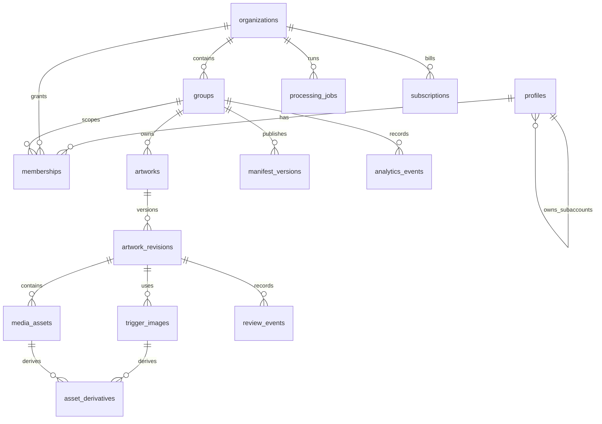

> Original design / experiment note (May 2026). Current scope and verification: [root README](../README.md) and [validation](../docs/validation.md). Historical SDK paths and logs may be absent from this extracted repository.

# Postgres-Datenmodell fuer die gruppenbasierte AR-Plattform

Stand: 2026-05-30

Quelle der Wahrheit fuer Contract-Begriffe und Manifest-Schema:
`Plattform/contracts.md`

## Zielbild

Die Plattform ist mandantenfaehig und gruppenbasiert. Organisationen wie Schulen,
Firmen oder Kunden koennen Gruppen anlegen. Innerhalb einer Gruppe laden User
Triggerbilder und AR-Medien hoch. Die Unity-App laedt nach Login nur die Daten der
Gruppen, auf die der User Zugriff hat.

Es gibt keine globale Erkennungsdatenbank. Triggerbilder und AR-Inhalte sind immer
an Organisationen und Gruppen gebunden. Fuer die App werden pro Gruppe versionierte
Manifeste erzeugt. Neue Trigger und Medien koennen dadurch ohne App-Rebuild
genutzt werden.

## Grundprinzipien

- `auth.users` von Supabase bleibt die technische Login-Quelle.
- Eigene Userdaten liegen in `profiles`.
- Rechte werden ueber `memberships` vergeben.
- Inhalte gehoeren immer zu genau einer `organization` und einer `group`.
- `artworks` sind stabile AR-Einheiten.
- Der Workflow liegt auf `artwork_revisions`.
- `trigger_images` und `media_assets` haengen an einer Revision.
- Abgeleitete Dateien liegen in `asset_derivatives`; Manifeste referenzieren
  Derivatives, nicht Originaldateien.
- `trigger_images.target_key` ist der stabile Unity-`targetId`.
- `manifest_versions` sind unveraenderliche Snapshots.
- Loeschung erfolgt primaer als Soft Delete oder Archivierung.
- Komplexe Rechte- und Workflow-Regeln liegen in der API-Schicht.
- RLS kann einfache Mandantentrennung absichern, sollte aber nicht die komplette
  Businesslogik tragen.

## ERD



## Enums und Statuswerte

Empfohlen sind Postgres Enums oder, falls mehr Flexibilitaet gewuenscht ist,
`text` mit `check` Constraints.

```sql
create type membership_role as enum (
  'owner',
  'admin',
  'editor',
  'reviewer',
  'viewer'
);

create type membership_status as enum (
  'invited',
  'active',
  'suspended',
  'revoked'
);

create type account_type as enum (
  'primary',
  'subaccount',
  'service'
);

create type lifecycle_status as enum (
  'active',
  'archived',
  'deleted'
);

create type revision_status as enum (
  'draft',
  'in_review',
  'changes_requested',
  'approved',
  'published',
  'superseded',
  'rejected'
);

create type asset_processing_status as enum (
  'upload_pending',
  'uploaded',
  'queued',
  'processing',
  'ready',
  'needs_manual_review',
  'rejected',
  'failed_retryable',
  'failed_permanent',
  'superseded',
  'deleted'
);

create type trigger_quality_status as enum (
  'pending',
  'passed',
  'warning',
  'failed'
);

create type job_status as enum (
  'queued',
  'running',
  'succeeded',
  'failed_retryable',
  'failed_permanent',
  'cancelled',
  'dead_letter'
);

create type manifest_status as enum (
  'building',
  'published',
  'superseded',
  'revoked',
  'failed'
);
```

Manifestfaehig sind im MVP nur Assets und Derivatives mit
`processing_status = 'ready'`. `needs_manual_review` darf nicht automatisch ins
Manifest; eine technische Warnung muss durch die API mit passender Capability
freigegeben werden. `rejected`, `failed_retryable`, `failed_permanent` und
`deleted` duerfen nie in neue Manifeste gelangen.

## Tabellen

### profiles

Ergaenzt Supabase `auth.users`. Diese Tabelle enthaelt App-spezifische Userdaten,
Subaccount-Beziehungen und Anzeigenamen.

Wichtige Felder:

```sql
profiles (
  id uuid primary key references auth.users(id) on delete cascade,
  email text not null,
  display_name text,
  avatar_url text,
  account_type account_type not null default 'primary',
  parent_profile_id uuid references profiles(id),
  created_by_profile_id uuid references profiles(id),
  status lifecycle_status not null default 'active',
  metadata jsonb not null default '{}',
  created_at timestamptz not null default now(),
  updated_at timestamptz not null default now(),
  deleted_at timestamptz
)
```

Hinweise:

- `account_type = 'subaccount'` bedeutet nicht automatisch "weniger Rechte".
- Rechte kommen aus `memberships`.
- Subaccounts koennen durch API-Regeln zusaetzlich eingeschraenkt werden.

### organizations

Mandant, Abrechnungseinheit und oberster Verwaltungsbereich.

```sql
organizations (
  id uuid primary key default gen_random_uuid(),
  name text not null,
  slug text not null,
  owner_profile_id uuid not null references profiles(id),
  settings jsonb not null default '{}',
  metadata jsonb not null default '{}',
  created_at timestamptz not null default now(),
  updated_at timestamptz not null default now(),
  archived_at timestamptz,
  deleted_at timestamptz
)
```

Beziehungen:

- Eine Organisation hat viele Gruppen.
- Eine Organisation hat viele Memberships.
- Eine Organisation kann eine Subscription haben.

### groups

Fachlicher Scope fuer Uploads, Trigger, Manifeste und App-Zugriff.

```sql
groups (
  id uuid primary key default gen_random_uuid(),
  org_id uuid not null references organizations(id),
  name text not null,
  slug text not null,
  description text,
  created_by uuid not null references profiles(id),
  current_manifest_version_id uuid,
  settings jsonb not null default '{}',
  metadata jsonb not null default '{}',
  created_at timestamptz not null default now(),
  updated_at timestamptz not null default now(),
  archived_at timestamptz,
  deleted_at timestamptz
)
```

Hinweise:

- Die Unity-App synchronisiert gruppenweise.
- `current_manifest_version_id` zeigt auf das aktuell publizierte Manifest.
- Archivierte Gruppen koennen weiterhin historische Analytics enthalten.

### memberships

Vergibt Rollen auf Organisations- oder Gruppenebene.

```sql
memberships (
  id uuid primary key default gen_random_uuid(),
  org_id uuid not null references organizations(id),
  group_id uuid references groups(id),
  profile_id uuid not null references profiles(id),
  role membership_role not null,
  status membership_status not null default 'invited',
  invited_by uuid references profiles(id),
  accepted_at timestamptz,
  created_at timestamptz not null default now(),
  updated_at timestamptz not null default now(),
  revoked_at timestamptz
)
```

Interpretation:

- `group_id is null`: Rolle gilt organisationsweit.
- `group_id is not null`: Rolle gilt nur in dieser Gruppe.
- Ein User kann in Organisation A `viewer` und in Gruppe B `editor` sein.
- API kann die effektive Rolle aus Org- und Gruppenmitgliedschaft berechnen.

Grobe Verwaltungs-Hierarchie:

```text
owner > admin > viewer
```

Fachlich sind `reviewer` und `editor` keine reine Leiter. Ein `editor` darf
Uploads und Drafts bearbeiten, ein `reviewer` darf pruefen. Ob ein `reviewer`
auch publishen darf, ist eine Capability der API und haengt z.B. von
`organization.settings.allow_reviewer_publish` ab.

### artworks

Stabile AR-Einheit. Ein Artwork hat mehrere Revisionen. Verlinkungen in Analytics,
Admin-UI und App koennen langfristig auf dem Artwork bleiben, auch wenn Inhalte
versioniert werden.

```sql
artworks (
  id uuid primary key default gen_random_uuid(),
  org_id uuid not null references organizations(id),
  group_id uuid not null references groups(id),
  title text not null,
  description text,
  created_by uuid not null references profiles(id),
  current_draft_revision_id uuid,
  current_published_revision_id uuid,
  lifecycle_status lifecycle_status not null default 'active',
  tags text[] not null default '{}',
  metadata jsonb not null default '{}',
  created_at timestamptz not null default now(),
  updated_at timestamptz not null default now(),
  archived_at timestamptz,
  deleted_at timestamptz
)
```

Hinweise:

- `artworks` selbst sollten nicht direkt `draft` oder `published` sein.
- Der sichtbare App-Zustand kommt aus `current_published_revision_id`.
- Ein neues Update erzeugt eine neue Revision statt die publizierte Revision zu
  ueberschreiben.

### artwork_revisions

Workflow- und Versionsebene fuer ein Artwork.

```sql
artwork_revisions (
  id uuid primary key default gen_random_uuid(),
  artwork_id uuid not null references artworks(id),
  org_id uuid not null references organizations(id),
  group_id uuid not null references groups(id),
  revision_no integer not null,
  status revision_status not null default 'draft',
  created_by uuid not null references profiles(id),
  submitted_by uuid references profiles(id),
  submitted_at timestamptz,
  reviewed_by uuid references profiles(id),
  reviewed_at timestamptz,
  published_by uuid references profiles(id),
  published_at timestamptz,
  review_note text,
  change_summary text,
  metadata jsonb not null default '{}',
  created_at timestamptz not null default now(),
  updated_at timestamptz not null default now()
)
```

Workflow:

```text
draft -> in_review -> changes_requested -> draft
draft -> in_review -> rejected
draft -> in_review -> approved -> published
published -> superseded
```

Empfohlene Regeln:

- `editor` darf Drafts erstellen und zur Review einreichen.
- `reviewer` darf Review-Entscheidungen treffen.
- `owner` und `admin` duerfen in der Regel direkt veroeffentlichen.
- Subaccounts mit `editor` duerfen hochladen, aber standardmaessig nicht
  veroeffentlichen.
- Publish ist eine API-Aktion, die auch Manifest-Neubau ausloest.

### trigger_images

Triggerbilder fuer die lokale AR-Erkennung auf dem Geraet.

```sql
trigger_images (
  id uuid primary key default gen_random_uuid(),
  artwork_revision_id uuid not null references artwork_revisions(id),
  artwork_id uuid not null references artworks(id),
  org_id uuid not null references organizations(id),
  group_id uuid not null references groups(id),
  uploaded_by uuid not null references profiles(id),
  target_key text not null,
  storage_key_original text not null,
  mime_type text not null,
  width integer,
  height integer,
  bytes bigint not null,
  sha256 text not null,
  physical_width_m numeric(8,4),
  quality_status trigger_quality_status not null default 'pending',
  quality_score numeric(5,2),
  quality_report jsonb not null default '{}',
  processing_status asset_processing_status not null default 'upload_pending',
  created_at timestamptz not null default now(),
  updated_at timestamptz not null default now(),
  deleted_at timestamptz
)
```

`target_key` ist der stabile fachliche Key fuer Unity und wird im Manifest als
`targetId` ausgegeben. Er ist stabil ueber Revisionen und Re-Uploads. Die
revisionsspezifische `trigger_images.id` darf nicht als Unity-`targetId`
verwendet werden.

MVP mit einem Trigger pro Artwork:

```text
target_key = "target_" + artwork_id
```

Robustere Empfehlung:

```text
target_key = "trg_" + stable_random_id
```

Bei spaeterem Multi-Trigger pro Artwork sollte eine eigene Tabelle
`artwork_targets(id, artwork_id, target_key, display_name, sort_order,
lifecycle_status)` eingefuehrt werden.

Trigger-Qualitaetspruefung:

- OpenCV prueft Kontrast, Schaerfe, Feature-Punkte und Bildgroesse.
- `arcoreimg` kann einen Score fuer Android/ARCore liefern.
- Worker-Mapping:
  - Score >= 75 und Checks ok: `processing_status = 'ready'`,
    `quality_status = 'passed'`.
  - Score 50-74 oder technische Warnung:
    `processing_status = 'needs_manual_review'`,
    `quality_status = 'warning'`.
  - Score < 50 oder harter Fehler: `processing_status = 'rejected'`,
    `quality_status = 'failed'`.
- Die API blockiert Publish, wenn `quality_status = 'failed'` oder
  `processing_status` nicht manifestfaehig ist.
- `warning` darf nur mit passender Capability freigegeben werden.

### media_assets

AR-Content: Bilder, Videos, 3D-Modelle, Audio, Thumbnails und abgeleitete Dateien.

```sql
media_assets (
  id uuid primary key default gen_random_uuid(),
  artwork_revision_id uuid not null references artwork_revisions(id),
  artwork_id uuid not null references artworks(id),
  org_id uuid not null references organizations(id),
  group_id uuid not null references groups(id),
  uploaded_by uuid not null references profiles(id),
  asset_type text not null check (
    asset_type in ('image', 'video', 'model3d', 'audio', 'thumbnail')
  ),
  content_role text not null default 'primary' check (
    content_role in ('primary', 'thumbnail', 'secondary')
  ),
  storage_key_original text not null,
  mime_type text not null,
  bytes bigint not null,
  sha256 text not null,
  width integer,
  height integer,
  duration_seconds numeric(10,3),
  processing_status asset_processing_status not null default 'upload_pending',
  processing_report jsonb not null default '{}',
  metadata jsonb not null default '{}',
  created_at timestamptz not null default now(),
  updated_at timestamptz not null default now(),
  deleted_at timestamptz
)
```

`media_assets` beschreibt Original-Uploads und ihre fachliche Rolle. Optimierte,
transcodierte oder normalisierte Ausgaben werden in `asset_derivatives`
abgelegt. Das Manifest referenziert diese Derivatives.

`media_assets.id` wird im MVP als `content[].contentId` ausgegeben.
`content_role` wird im Manifest als Top-Level-`content[].role` ausgegeben. Fuer
den MVP zeigt Unity nur `role = 'primary'` an, muss aber das Top-Level-Array
`content[]` deserialisieren.

Beispiele fuer `metadata`:

```json
{
  "placement": "image_target",
  "scale": 1.0,
  "loop": true,
  "autoplay": true,
  "model_bounds": {
    "x": 1.2,
    "y": 0.8,
    "z": 0.4
  }
}
```

### asset_derivatives

MVP-Tabelle fuer Worker-Outputs wie normalisierte Triggerbilder, Thumbnails,
optimierte Bilder, transcodierte Videos und validierte GLB-Dateien.

```sql
asset_derivatives (
  id uuid primary key default gen_random_uuid(),
  org_id uuid not null references organizations(id),
  group_id uuid not null references groups(id),
  trigger_image_id uuid references trigger_images(id),
  media_asset_id uuid references media_assets(id),
  kind text not null,
  storage_key text not null,
  cdn_url text,
  mime_type text not null,
  width integer,
  height integer,
  duration_seconds numeric(10,3),
  bytes bigint not null,
  sha256 text not null,
  metadata jsonb not null default '{}',
  processing_status asset_processing_status not null default 'ready',
  created_at timestamptz not null default now(),
  constraint asset_derivatives_one_parent check (
    (trigger_image_id is not null and media_asset_id is null)
    or
    (trigger_image_id is null and media_asset_id is not null)
  )
)
```

Kanonische `kind`-Werte:

```text
trigger.normalized
trigger.thumbnail
image.optimized_2048
image.optimized_1024
image.thumbnail_512
video.mp4_1080p
video.thumbnail_512
model.glb_validated
```

Hinweise:

- Ein einzelnes `storage_key_processed` auf `trigger_images` oder
  `media_assets` reicht nicht fuer den MVP, weil Worker mehrere Outputs
  erzeugen.
- `trigger.normalized` ist die Quelle fuer `targets[].image`.
- Top-Level-`content[]` referenziert passende Derivatives zu `media_assets`.
- `targets[]` enthalten keine verschachtelten Content-Objekte, sondern nur
  `contentIds[]` und `primaryContentId`.
- User-Dateinamen duerfen nicht in R2 Object Keys verwendet werden.

R2 Object Key Convention:

```text
raw/{orgId}/{groupId}/{artworkId}/{revisionId}/trigger/{triggerImageId}/original
raw/{orgId}/{groupId}/{artworkId}/{revisionId}/media/{mediaAssetId}/original

derived/{orgId}/{groupId}/{artworkId}/{revisionId}/trigger/{triggerImageId}/trigger_normalized.jpg
derived/{orgId}/{groupId}/{artworkId}/{revisionId}/trigger/{triggerImageId}/thumb_512.webp
derived/{orgId}/{groupId}/{artworkId}/{revisionId}/media/{mediaAssetId}/video_1080p.mp4
derived/{orgId}/{groupId}/{artworkId}/{revisionId}/media/{mediaAssetId}/thumb_512.webp
derived/{orgId}/{groupId}/{artworkId}/{revisionId}/media/{mediaAssetId}/model.glb

manifests/{orgId}/{groupId}/manifest-v{manifestVersion}.json
manifests/{orgId}/{groupId}/latest.json
```

### processing_jobs

Queue-nahe DB-Tabelle fuer Nachvollziehbarkeit. BullMQ/Redis bleibt die operative
Queue; Postgres bleibt Audit- und Statusquelle.

```sql
processing_jobs (
  id uuid primary key default gen_random_uuid(),
  org_id uuid not null references organizations(id),
  group_id uuid references groups(id),
  job_type text not null check (
    job_type in (
      'trigger.validate',
      'image.optimize',
      'video.transcode',
      'model.validate',
      'manifest.rebuild'
    )
  ),
  target_type text not null,
  target_id uuid not null,
  status job_status not null default 'queued',
  priority integer not null default 100,
  attempts integer not null default 0,
  max_attempts integer not null default 3,
  run_after timestamptz,
  locked_by text,
  locked_at timestamptz,
  input jsonb not null default '{}',
  output jsonb not null default '{}',
  error_message text,
  idempotency_key text,
  created_at timestamptz not null default now(),
  started_at timestamptz,
  finished_at timestamptz
)
```

Hinweise:

- Job-Typen verwenden Dot-Notation. Alte Namen wie `trigger_quality`,
  `image_optimize`, `video_transcode`, `model_optimize` und `manifest_build`
  werden durch die kanonischen Namen ersetzt.
- `model.validate` validiert im MVP GLB-Dateien und erzwingt Limits. Echte
  3D-Optimierung wie Draco/KTX2 sollte spaeter ein eigener Job werden, z.B.
  `model.optimize`.
- `idempotency_key` verhindert doppelte Jobs bei Retry/API-Wiederholung.
- Worker sollten mit Service Role arbeiten, nicht mit Enduser-RLS.
- Jobs sollten nie direkt Client-gesteuert beliebige Targets verarbeiten.

### manifest_versions

Versionierte Unity-Manifeste pro Gruppe. Diese Snapshots sind nach Publish
unveraenderlich.

```sql
manifest_versions (
  id uuid primary key default gen_random_uuid(),
  org_id uuid not null references organizations(id),
  group_id uuid not null references groups(id),
  version_no integer not null,
  status manifest_status not null default 'building',
  schema_version text not null default '1.0',
  min_app_version text,
  recommended_app_version text,
  cache_max_age_seconds integer not null default 3600,
  cache_stale_while_revalidate_seconds integer not null default 86400,
  previous_manifest_version_id uuid references manifest_versions(id),
  storage_key text,
  cdn_url text,
  etag text,
  sha256 text,
  manifest_json jsonb not null default '{}',
  trigger_count integer not null default 0,
  asset_count integer not null default 0,
  bytes_total bigint not null default 0,
  deleted_target_ids text[] not null default '{}',
  is_current boolean not null default false,
  created_by uuid references profiles(id),
  created_at timestamptz not null default now(),
  published_at timestamptz,
  revoked_at timestamptz
)
```

Manifest-Inhalt, vereinfacht:

```json
{
  "schemaVersion": "1.0",
  "manifestVersion": 42,
  "manifestId": "mfst_042",
  "generatedAt": "2026-05-30T12:00:00Z",
  "etag": "grp_biology_8a-v42",
  "organization": {
    "id": "org_uuid",
    "name": "Schule Nord"
  },
  "group": {
    "id": "group_uuid",
    "name": "Biologie 8A"
  },
  "cache": {
    "maxAgeSeconds": 3600,
    "staleWhileRevalidateSeconds": 86400
  },
  "limits": {
    "activeTargetCount": 100,
    "maxMovingImages": 1
  },
  "content": [
    {
      "contentId": "media_uuid",
      "type": "model3d",
      "role": "primary",
      "url": "https://cdn.example.com/derived/org/group/art/rev/media/model.glb",
      "contentType": "model/gltf-binary",
      "byteSize": 3120044,
      "sha256": "9af1c...",
      "metadata": {
        "placement": "onImage",
        "scale": 1.0,
        "loop": true
      }
    },
    {
      "contentId": "thumbnail_media_uuid",
      "type": "image",
      "role": "thumbnail",
      "url": "https://cdn.example.com/derived/org/group/art/rev/media/thumb_512.webp",
      "contentType": "image/webp",
      "byteSize": 84211,
      "sha256": "1ac88..."
    }
  ],
  "targets": [
    {
      "targetId": "trg_q8s2k1",
      "artworkId": "artwork_uuid",
      "revisionId": "revision_uuid",
      "triggerImageId": "trigger_uuid",
      "title": "Zelle mit 3D-Modell",
      "locale": "de-DE",
      "tags": ["biologie", "zelle"],
      "updatedAt": "2026-05-30T12:00:00Z",
      "physicalWidthMeters": 0.18,
      "image": {
        "url": "https://cdn.example.com/derived/org/group/art/rev/trigger/trigger_normalized.jpg",
        "contentType": "image/jpeg",
        "width": 1600,
        "height": 1200,
        "byteSize": 421234,
        "sha256": "77bb7f7a..."
      },
      "quality": {
        "status": "passed",
        "score": 0.82,
        "featureCount": 735,
        "arcoreScore": 82,
        "warnings": []
      },
      "contentIds": ["media_uuid", "thumbnail_media_uuid"],
      "primaryContentId": "media_uuid"
    }
  ],
  "deletedTargetIds": [],
  "requiredApp": {
    "minVersion": "1.0.0",
    "recommendedVersion": "1.2.0"
  }
}
```

Manifest-Regeln:

- `schemaVersion` ist ein String, z.B. `"1.0"`.
- `manifestVersion` entspricht `manifest_versions.version_no` und steigt pro
  Gruppe monoton.
- `targets[]` ist der einzige Top-Level-Container fuer AR-Ziele.
- `content[]` ist ein eigenes Top-Level-Array parallel zu `targets[]`.
- `targetId` kommt aus `trigger_images.target_key`.
- `content[].contentId` ist im MVP `media_assets.id`.
- `targets[].contentIds[]` enthaelt IDs aus `content[].contentId`.
- `targets[].primaryContentId` muss in `targets[].contentIds[]` und in
  `content[].contentId` existieren.
- Targets enthalten kein verschachteltes `content[]`.
- `physicalWidthMeters` ist fuer jedes Target verpflichtend.
- `image.sha256` ist der Cache-Key fuer Triggerbilder.
- `content[].sha256` ist der Cache-Key fuer Medien.
- `deletedTargetIds` enthaelt stabile `target_key`-Werte, keine DB-IDs.

Unity-App:

- Login ermittelt erlaubte Gruppen.
- App fragt fuer jede Gruppe das aktuelle Manifest ab.
- App vergleicht `version_no`, `etag` oder `sha256`.
- Neue oder veraenderte Assets werden lokal gecacht.
- Runtime Image Library wird aus den Triggerbildern des Manifests aufgebaut.
- Unity verwendet `targetId` als `referenceImage.name` und loest darueber
  `target -> primaryContentId -> content` auf.
- Kein App-Rebuild bei neuen Uploads.

### review_events

Audit-Trail fuer Workflow-Aktionen.

```sql
review_events (
  id uuid primary key default gen_random_uuid(),
  org_id uuid not null references organizations(id),
  group_id uuid not null references groups(id),
  artwork_revision_id uuid not null references artwork_revisions(id),
  actor_profile_id uuid not null references profiles(id),
  action text not null check (
    action in (
      'create_draft',
      'submit',
      'approve',
      'request_changes',
      'reject',
      'publish',
      'supersede',
      'archive'
    )
  ),
  from_status revision_status,
  to_status revision_status,
  comment text,
  metadata jsonb not null default '{}',
  created_at timestamptz not null default now()
)
```

### analytics_events

Ereignisse aus Unity-App und Web-App. Bei hohem Volumen partitionieren.

```sql
analytics_events (
  id uuid primary key default gen_random_uuid(),
  org_id uuid not null references organizations(id),
  group_id uuid references groups(id),
  profile_id uuid references profiles(id),
  device_id_hash text,
  session_id text,
  event_type text not null,
  target_key text,
  artwork_id uuid references artworks(id),
  trigger_image_id uuid references trigger_images(id),
  media_asset_id uuid references media_assets(id),
  manifest_version_id uuid references manifest_versions(id),
  app_version text,
  platform text,
  occurred_at timestamptz not null,
  received_at timestamptz not null default now(),
  payload jsonb not null default '{}'
)
```

Typische Events:

```text
app_opened
manifest_checked
manifest_downloaded
target_add_started
target_add_completed
target_add_failed
trigger_detected
content_view_started
content_view_completed
content_error
```

### subscriptions optional

Billing, Quotas und Plan-Limits pro Organisation.

```sql
subscriptions (
  id uuid primary key default gen_random_uuid(),
  org_id uuid not null references organizations(id),
  provider text not null,
  provider_customer_id text,
  provider_subscription_id text,
  plan text not null,
  status text not null check (
    status in ('trialing', 'active', 'past_due', 'cancelled', 'expired')
  ),
  seats_limit integer,
  storage_limit_bytes bigint,
  groups_limit integer,
  monthly_upload_limit integer,
  current_period_start timestamptz,
  current_period_end timestamptz,
  metadata jsonb not null default '{}',
  created_at timestamptz not null default now(),
  updated_at timestamptz not null default now()
)
```

## Beziehungen

Organisationen:

- `organizations.id -> groups.org_id`
- `organizations.id -> memberships.org_id`
- `organizations.id -> artworks.org_id`
- `organizations.id -> asset_derivatives.org_id`
- `organizations.id -> manifest_versions.org_id`
- `organizations.id -> subscriptions.org_id`

Gruppen:

- `groups.id -> memberships.group_id`
- `groups.id -> artworks.group_id`
- `groups.id -> artwork_revisions.group_id`
- `groups.id -> trigger_images.group_id`
- `groups.id -> media_assets.group_id`
- `groups.id -> asset_derivatives.group_id`
- `groups.id -> manifest_versions.group_id`

User:

- `auth.users.id -> profiles.id`
- `profiles.id -> memberships.profile_id`
- `profiles.id -> artworks.created_by`
- `profiles.id -> artwork_revisions.created_by`

Content:

- `artworks.id -> artwork_revisions.artwork_id`
- `artwork_revisions.id -> trigger_images.artwork_revision_id`
- `artwork_revisions.id -> media_assets.artwork_revision_id`
- `artwork_revisions.id -> review_events.artwork_revision_id`
- `trigger_images.id -> asset_derivatives.trigger_image_id`
- `media_assets.id -> asset_derivatives.media_asset_id`

## Indizes

```sql
-- Profile
create unique index profiles_email_unique
  on profiles(lower(email))
  where deleted_at is null;

create index profiles_parent_idx
  on profiles(parent_profile_id)
  where deleted_at is null;

-- Organizations
create unique index organizations_slug_unique
  on organizations(slug)
  where deleted_at is null;

-- Groups
create unique index groups_org_slug_unique
  on groups(org_id, slug)
  where deleted_at is null;

create index groups_org_active_idx
  on groups(org_id, created_at desc)
  where deleted_at is null and archived_at is null;

-- Memberships
create index memberships_profile_idx
  on memberships(profile_id)
  where status = 'active';

create index memberships_org_profile_idx
  on memberships(org_id, profile_id)
  where status = 'active';

create index memberships_group_profile_idx
  on memberships(group_id, profile_id)
  where status = 'active';

create unique index memberships_org_unique
  on memberships(org_id, profile_id)
  where group_id is null and status <> 'revoked';

create unique index memberships_group_unique
  on memberships(group_id, profile_id)
  where group_id is not null and status <> 'revoked';

-- Artworks
create index artworks_group_status_idx
  on artworks(group_id, lifecycle_status, updated_at desc);

create index artworks_org_idx
  on artworks(org_id, updated_at desc)
  where deleted_at is null;

-- Revisions
create unique index artwork_revisions_revision_unique
  on artwork_revisions(artwork_id, revision_no);

create index artwork_revisions_group_status_idx
  on artwork_revisions(group_id, status, updated_at desc);

create index artwork_revisions_review_queue_idx
  on artwork_revisions(group_id, submitted_at asc)
  where status = 'in_review';

-- Trigger images
create unique index trigger_images_group_sha_unique
  on trigger_images(group_id, sha256)
  where deleted_at is null;

create index trigger_images_target_key_idx
  on trigger_images(group_id, target_key, created_at desc)
  where deleted_at is null;

create unique index trigger_images_revision_target_unique
  on trigger_images(artwork_revision_id, target_key)
  where deleted_at is null;

create index trigger_images_revision_idx
  on trigger_images(artwork_revision_id)
  where deleted_at is null;

create index trigger_images_quality_idx
  on trigger_images(group_id, quality_status);

-- Media assets
create index media_assets_revision_idx
  on media_assets(artwork_revision_id)
  where deleted_at is null;

create index media_assets_processing_idx
  on media_assets(processing_status, updated_at desc);

create index media_assets_group_type_idx
  on media_assets(group_id, asset_type);

-- Asset derivatives
create index asset_derivatives_trigger_idx
  on asset_derivatives(trigger_image_id, kind);

create index asset_derivatives_media_idx
  on asset_derivatives(media_asset_id, kind);

create unique index asset_derivatives_storage_key_unique
  on asset_derivatives(storage_key);

create index asset_derivatives_ready_idx
  on asset_derivatives(group_id, kind)
  where processing_status = 'ready';

-- Processing jobs
create index processing_jobs_queue_idx
  on processing_jobs(status, priority asc, run_after asc, created_at asc);

create index processing_jobs_target_idx
  on processing_jobs(target_type, target_id);

create unique index processing_jobs_idempotency_unique
  on processing_jobs(idempotency_key)
  where idempotency_key is not null;

-- Manifest versions
create unique index manifest_versions_group_version_unique
  on manifest_versions(group_id, version_no);

create unique index manifest_versions_current_unique
  on manifest_versions(group_id)
  where is_current = true;

create index manifest_versions_group_status_idx
  on manifest_versions(group_id, status, version_no desc);

-- Analytics
create index analytics_events_group_time_idx
  on analytics_events(group_id, occurred_at desc);

create index analytics_events_artwork_time_idx
  on analytics_events(artwork_id, occurred_at desc);

create index analytics_events_manifest_time_idx
  on analytics_events(manifest_version_id, occurred_at desc);

create index analytics_events_target_time_idx
  on analytics_events(group_id, target_key, occurred_at desc)
  where target_key is not null;

-- Subscriptions
create unique index subscriptions_org_active_unique
  on subscriptions(org_id)
  where status in ('trialing', 'active', 'past_due');
```

## Rechte- und Rollenmodell

### Rollen

`owner`

- Organisation verwalten
- Billing und Subscription verwalten
- Owner/Admins einladen
- Gruppen anlegen, archivieren und loeschen
- Alle Inhalte bearbeiten, reviewen und publishen
- Manifeste neu bauen oder zurueckziehen

`admin`

- Gruppen und Mitglieder verwalten
- Inhalte bearbeiten
- Review und Publish ausfuehren
- Keine Owner-Uebergabe
- Billing nur optional, wenn Produkt-Policy das erlaubt

`editor`

- Artworks erstellen
- Triggerbilder hochladen
- Medien hochladen
- Drafts bearbeiten
- Zur Review einreichen
- Standardmaessig nicht publishen

`reviewer`

- Review-Queue sehen
- Aenderungen anfordern
- Ablehnen
- Freigeben
- Publish je nach Organisations-Policy erlaubt oder nur fuer Admin/Owner

`viewer`

- Veroeffentlichte Inhalte lesen
- Manifeste laden
- Keine Uploads
- Keine Drafts oder Review-Inhalte sehen, ausser die API erlaubt es explizit

Capabilities sind keine eigenen DB-Rollen. Die API kann sie aus Rolle,
Scope, Organisations-Settings und Subaccount-Regeln ableiten:

```text
can_publish
can_manage_members
can_manage_billing
can_use_app
can_override_technical_warning
```

### Subaccounts

Subaccounts werden ueber `profiles.account_type = 'subaccount'` und
`parent_profile_id` abgebildet.

Empfohlene Standardregeln:

- Subaccount mit `editor`: Upload und Draft erlaubt.
- Subaccount mit `editor`: Publish nicht erlaubt.
- Subaccount mit `reviewer`: Review erlaubt, Publish nur wenn API-Policy dies
  ausdruecklich erlaubt.
- Subaccount mit `viewer`: nur lesen.
- Parent-Account kann Subaccounts verwalten, sofern seine eigene Rolle das erlaubt.

### Effektive Rechte

Die API berechnet fuer einen Request:

1. Ist der User aktiv?
2. Ist die Organisation aktiv?
3. Ist die Gruppe aktiv?
4. Gibt es eine aktive Org-Membership?
5. Gibt es eine aktive Gruppen-Membership?
6. Welche Rolle ist effektiver fuer diese Aktion?
7. Ist der Account ein Subaccount mit Zusatzbeschraenkungen?
8. Ist der Workflow-Status fuer die Aktion passend?
9. Sind Subscription, Quota und Storage-Limits ok?

Beispiel:

```text
can_upload =
  role in (owner, admin, editor)
  and membership.status = active
  and group.deleted_at is null
  and subscription allows uploads

can_submit_review =
  role in (owner, admin, editor)
  and revision.status in (draft, changes_requested)

can_publish =
  role in (owner, admin)
  or (role = reviewer and organization.settings.allow_reviewer_publish = true)
```

## RLS-Empfehlung fuer Supabase

RLS sollte die Basis absichern, aber nicht jede Produktregel nachbilden.

Gut fuer RLS:

- User sieht nur Organisationen mit aktiver Membership.
- User sieht nur Gruppen mit aktiver Membership oder Org-Rolle.
- User sieht nur veroeffentlichte Manifestdaten fuer erlaubte Gruppen.
- User sieht nur manifestfaehige `asset_derivatives` fuer erlaubte Gruppen.
- User darf eigene Profile-Basisdaten lesen.
- Viewer darf keine Draft-Revisionen lesen.

Vorsichtig mit RLS:

- Rollen-Hierarchien ueber mehrere Ebenen.
- Review-Transitions.
- Publish-Regeln.
- Quotas.
- Subaccount-Sonderregeln.
- Storage-Lifecycle.
- Worker-Zugriffe.

Diese Pruefungen gehoeren besser in die API:

- Draft -> Review -> Published Transitionen.
- Ob ein Subaccount veroeffentlichen darf.
- Ob ein Reviewer wirklich publishen darf.
- Trigger-Qualitaetsgate vor Publish.
- Manifest-Build und Wechsel des aktuellen Manifests.
- Quotas aus `subscriptions`.
- Plausibilitaet von `org_id` und `group_id` bei Uploads.
- Signierte Upload-URLs fuer R2.
- Loeschung in R2/CDN.
- Idempotente Job-Erzeugung.

## API-freundliche Zugriffsmuster

### Gruppen fuer eingeloggten User laden

```sql
select g.*
from groups g
join memberships m
  on m.group_id = g.id
where m.profile_id = :profile_id
  and m.status = 'active'
  and g.deleted_at is null
  and g.archived_at is null;
```

In der API sollte zusaetzlich eine organisationsweite Membership mit
`group_id is null` beruecksichtigt werden.

### Review-Queue einer Gruppe

```sql
select r.*
from artwork_revisions r
where r.group_id = :group_id
  and r.status = 'in_review'
order by r.submitted_at asc;
```

### Aktuelles Manifest einer Gruppe

```sql
select *
from manifest_versions
where group_id = :group_id
  and is_current = true
  and status = 'published'
limit 1;
```

### Manifest-Worker-Queries

Der Worker baut das Manifest aus zwei getrennten Ergebnismengen:

- `content_rows` fuer das Top-Level-Array `content[]`.
- `target_rows` fuer `targets[]`; jede Target-Zeile enthaelt nur
  `contentIds[]` und `primaryContentId`.

`asset_derivatives` bleiben die kanonische Quelle fuer `targets[].image.url`
und `content[].url`. Originaldateien duerfen nicht direkt im Manifest landen.

Content-Query fuer Top-Level `content[]`:

```sql
select distinct on (m.id)
  m.id as content_id,
  m.asset_type as type,
  m.content_role as role,
  cd.cdn_url as url,
  cd.mime_type as content_type,
  cd.bytes as byte_size,
  cd.sha256,
  m.metadata
from artworks a
join artwork_revisions r
  on r.id = a.current_published_revision_id
join media_assets m
  on m.artwork_revision_id = r.id
join lateral (
  select d.*
  from asset_derivatives d
  where d.media_asset_id = m.id
    and d.processing_status = 'ready'
  order by
    case
      when m.asset_type = 'model3d' and d.kind = 'model.glb_validated' then 0
      when m.asset_type = 'video' and d.kind = 'video.mp4_1080p' then 0
      when m.asset_type = 'image' and d.kind in (
        'image.optimized_2048',
        'image.optimized_1024',
        'image.thumbnail_512'
      ) then 0
      else 10
    end,
    d.created_at desc
  limit 1
) cd on true
where a.group_id = :group_id
  and a.lifecycle_status = 'active'
  and r.status = 'published'
  and m.processing_status = 'ready'
  and m.deleted_at is null
order by m.id, m.created_at asc;
```

Der Worker mappt diese Spalten so:

```text
content[].contentId = content_rows.content_id
content[].type = content_rows.type
content[].role = content_rows.role
content[].url = content_rows.url
content[].contentType = content_rows.content_type
content[].byteSize = content_rows.byte_size
content[].sha256 = content_rows.sha256
content[].metadata = content_rows.metadata
```

Target-Query fuer `targets[]`:

```sql
select
  a.id as artwork_id,
  r.id as revision_id,
  t.id as trigger_image_id,
  t.target_key as target_id,
  a.title,
  a.tags,
  r.updated_at,
  t.physical_width_m as physical_width_meters,
  td.cdn_url as image_url,
  td.mime_type as image_content_type,
  td.width as image_width,
  td.height as image_height,
  td.bytes as image_byte_size,
  td.sha256 as image_sha256,
  t.quality_status,
  t.quality_score,
  t.quality_report,
  array_agg(m.id order by m.created_at asc) as content_ids,
  (array_agg(
    m.id
    order by
      case when m.content_role = 'primary' then 0 else 1 end,
      m.created_at asc
  ))[1] as primary_content_id
from artworks a
join artwork_revisions r
  on r.id = a.current_published_revision_id
join trigger_images t
  on t.artwork_revision_id = r.id
join asset_derivatives td
  on td.trigger_image_id = t.id
  and td.kind = 'trigger.normalized'
  and td.processing_status = 'ready'
join media_assets m
  on m.artwork_revision_id = r.id
  and m.processing_status = 'ready'
  and m.deleted_at is null
where a.group_id = :group_id
  and a.lifecycle_status = 'active'
  and r.status = 'published'
  and t.quality_status in ('passed', 'warning')
  and t.processing_status = 'ready'
  and t.deleted_at is null
  and exists (
    select 1
    from asset_derivatives md
    where md.media_asset_id = m.id
      and md.processing_status = 'ready'
  )
group by
  a.id,
  r.id,
  t.id,
  td.id;
```

Der Worker mappt diese Spalten so:

```text
targets[].targetId = target_rows.target_id
targets[].image.url = target_rows.image_url
targets[].image.sha256 = target_rows.image_sha256
targets[].contentIds = target_rows.content_ids
targets[].primaryContentId = target_rows.primary_content_id
```

`needs_manual_review` darf nicht automatisch in diese Ergebnisse gelangen. Wenn
eine technische Warnung bewusst ueberstimmt wird, sollte die API diesen Schritt
auditiert freigeben und den manifestfaehigen Status explizit herstellen.

## Manifest-Build-Prozess

1. Editor erstellt oder aktualisiert Artwork-Draft.
2. Trigger und Medien werden hochgeladen.
3. API erzeugt Jobs wie `trigger.validate`, `image.optimize`,
   `video.transcode` oder `model.validate`.
4. Worker verarbeitet Dateien und aktualisiert Statusfelder.
5. Editor reicht Revision zur Review ein.
6. Reviewer/Admin prueft.
7. Publish-Aktion setzt Revision auf `published`.
8. API erzeugt `processing_jobs` mit `job_type = 'manifest.rebuild'`.
9. Worker sammelt alle publizierten Revisionen der Gruppe.
10. Worker verwendet `trigger_images.target_key` als `targetId` und
    referenziert `asset_derivatives` statt Originaldateien.
11. Worker baut zuerst Top-Level `content[]` mit
    `contentId = media_assets.id`.
12. Worker baut danach `targets[]`; Targets enthalten nur `contentIds[]` und
    `primaryContentId`, kein verschachteltes `content[]`.
13. Worker erzeugt Manifest-Datei und laedt sie nach R2/CDN.
14. Worker erstellt `manifest_versions` mit neuer `version_no`.
15. In einer Transaktion:
    - alte aktuelle Version `is_current = false`, `status = 'superseded'`
    - neue Version `is_current = true`, `status = 'published'`
    - `groups.current_manifest_version_id = new_manifest_id`
16. Unity-App erkennt neue Version und synchronisiert.

## Archivierung und Loeschung

Empfehlung:

- Organisationen, Gruppen und Artworks zuerst archivieren.
- Physische Loeschung nur fuer Admin/Owner und nach Retention-Zeit.
- Manifeste nicht hart loeschen, solange Analytics darauf verweisen.
- Assets in R2 erst loeschen, wenn keine aktive oder historische Manifestversion
  sie referenziert oder wenn Retention-Policy dies erlaubt.

Soft-Delete-Felder:

```text
deleted_at
archived_at
lifecycle_status
revoked_at
```

Wichtig:

- `deleted_at` bedeutet "nicht mehr fuer neue Queries anzeigen".
- `archived_at` bedeutet "historisch behalten, nicht mehr aktiv nutzen".
- `revoked_at` bei Memberships beendet Zugriff.
- Manifest `revoked` kann genutzt werden, wenn eine veroeffentlichte Version
  aktiv zurueckgezogen werden muss.

## Konsistenzregeln

Diese Regeln sollten durch Constraints, Transaktionen oder API-Code abgesichert
werden:

- `groups.org_id` muss zur `memberships.org_id` passen.
- `artworks.org_id` muss zur `groups.org_id` passen.
- `artwork_revisions.group_id` muss zum Artwork passen.
- `trigger_images.group_id` und `media_assets.group_id` muessen zur Revision
  passen.
- Pro Artwork darf es nicht zwei Revisionen mit gleicher `revision_no` geben.
- Pro Gruppe darf nur ein Manifest `is_current = true` haben.
- Publish darf nur erfolgen, wenn Trigger und Medien verarbeitbar sind.
- Manifest darf nur publizierte Revisionen enthalten.

## Optional sinnvolle Zusatz-Tabellen

Fuer spaetere Ausbaustufen koennen diese Tabellen nuetzlich sein:

```text
organization_invites
group_invites
api_tokens
storage_objects
device_registrations
manifest_downloads
audit_log
webhooks
```

`storage_objects` kann sinnvoll werden, wenn R2-Dateien uebergreifend getrackt,
dedupliziert oder mit Retention-Policies geloescht werden sollen.

## Empfehlung fuer erste Implementierung

MVP-Tabellen:

1. `profiles`
2. `organizations`
3. `groups`
4. `memberships`
5. `artworks`
6. `artwork_revisions`
7. `trigger_images`
8. `media_assets`
9. `asset_derivatives`
10. `processing_jobs`
11. `manifest_versions`
12. `review_events`
13. `analytics_events`
14. `subscriptions` optional

Spaeter oder nur bei Bedarf:

- `subscriptions`, falls Billing oder harte Quotas nicht direkt im MVP
  umgesetzt werden.
- `storage_objects`, sobald Storage-Lifecycle komplexer wird.
- `audit_log`, sobald Admin-Aktionen rechtlich oder organisatorisch
  nachvollziehbar sein muessen.
