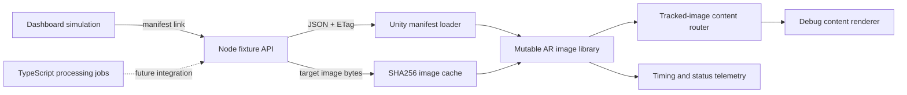

# Architecture

The manifest keeps targets and content in separate top-level arrays. Each target references `contentIds` and `primaryContentId`; the player indexes those identities before routing tracked-image events. Removed target IDs support incremental publication semantics.

The manifest loader uses conditional requests and a local JSON cache. Trigger images have a separate hash-keyed cache. The performance probe distinguishes cold and warm loads and reports target registration timings; those timings are pipeline measurements, not recognition-quality measurements.

The API implements a fixture-backed vertical slice. Publish gates prevent incomplete new revisions from being published. Its mock identity is not an authentication system. Publishing does not rebuild the static fixture manifest.

The worker separates job handlers from database, storage and image-processing interfaces. Jobs produce derivative metadata with the digest and size of the actual output. BullMQ registration is supplied, but the process entry point stops short of wiring production adapters.

The dashboard remains a browser-local simulation. Its interaction states illustrate the intended workflow; only the manifest link connects to the API. Database schemas and Supabase/R2 deployment in the design documents describe future architecture.
